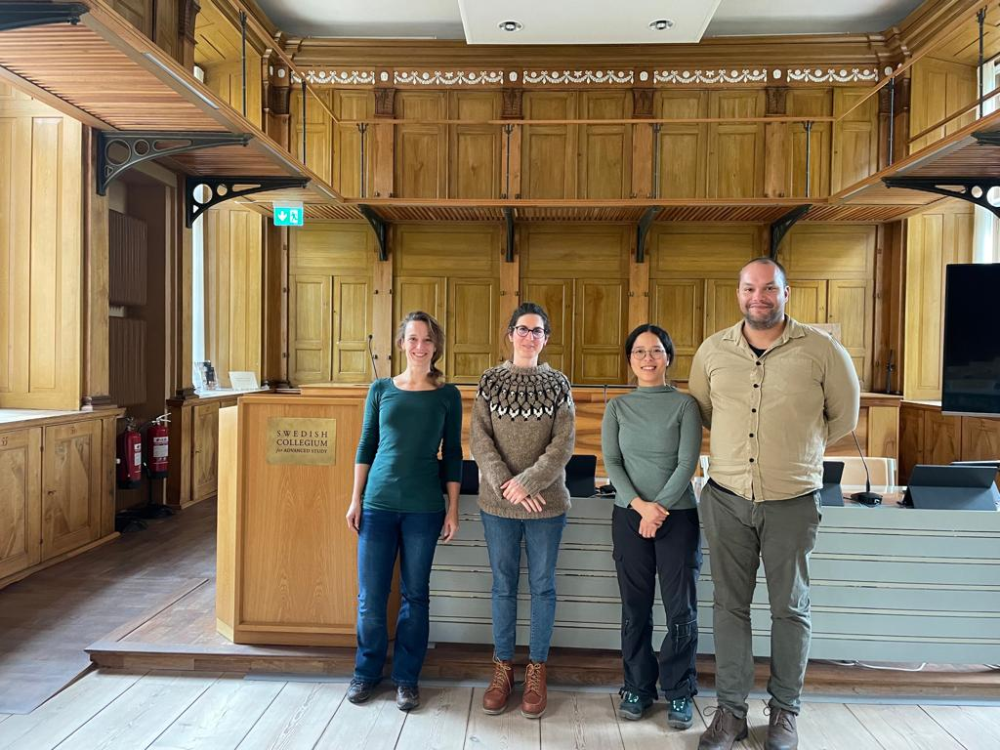



The development and use of quantitative models in water research and practice is both dominant and growing, importantly driven by recent technological developments. Although often presented as objective and neutral, models are controversial tools. They provide insights to predict future conditions of water systems, and opportunities to foster an integrated approach to tackle water-related challenges while addressing complexities related to managing fugitive resources such as water. Yet, models and modelling are specific ways of knowing water based on measurements and quantification. Foremost, models are profoundly shaped by the numerous, sometimes arbitrary, choices of the actors involved in the modelling process and by the context in which they are developed. With this project we seek to jointly research modelling as it is used to manage and govern water.

## Interdisciplinary

The project strengthens the collaboration between an interdisciplinary and international group of early career researchers studying water modelling in various contexts and from different perspectives, methodologies and approaches.

## Reflexivity

We are developing a reflexive approach to modelling that is helpful to make the ethical implications involved in modelling practices explicit, and invites modellers, funders, and users to act upon these. 

## Workshops

We seek to explore the challenges and opportunities to implement this novel approach through regular workshops, peer to peer learning and engagement with experts.

---

## Funding

Our project is funded by the Network of European Institutes for Advanced Study (NETIAS)  through the Constructive Advanced Thinking (CAT) program
